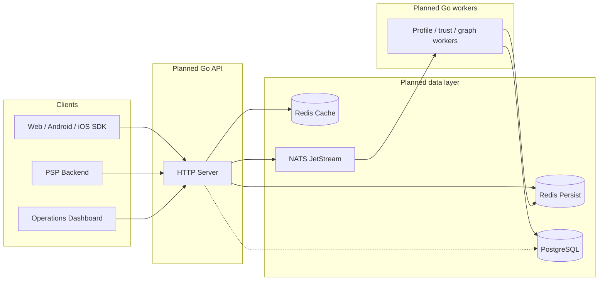

# Proposed architecture — Flint Secure

**Planned** technical architecture for the minor project (initial proposal).  
All components below **will be** designed and built during the semester unless noted as validation-only.

See [WRITING-GUIDE.md](WRITING-GUIDE.md) — do not describe this as already deployed in `proposal.pdf`.

## System context (planned)

## Design principles (planned)

1. **Hot path in memory** — `/v1/score` will prefetch Redis, then call a pure scoring function with no I/O inside it.
2. **Fail-open messaging** — If event publish fails after scoring, the API will still return the decision to protect checkout UX.
3. **Dual Redis** — Persistent store for devices/profiles; cache for velocity and rate limits.
4. **Explainability** — Responses will include component breakdown and reason codes.
5. **ML-ready stream** — Events will be retained for a future ML phase (out of proposal scope).

## Planned identify path

| Layer | Mechanism | Design target |
|-------|-----------|---------------|
| L1 | Exact `local_fp` in Redis Persist | ~85% hits |
| L2 | Stored `device_id` recovery after drift | Drift cases |
| L3 | Fuzzy match on tiered signals within block key | Remainder; threshold ~0.70 |

New devices: new UUID → Redis (TTL) → NATS `device.first_seen` → worker persistence to PostgreSQL.

## Planned score path

Weighted components **will include**:

- Device trust  
- Amount anomaly (wallet vs bank curves)  
- Time-of-day vs user profile  
- Velocity (Redis sorted sets, pipelined)  
- Recipient risk (worker-precomputed)  
- Network (GeoIP, TOR/VPN/datacenter signals)  
- Consistency / anti-spoof penalties  
- Identity (phone–device binding, SIM-swap-style rules)  
- Interaction terms (e.g. new device × large amount)

Hard floors **will** force **BLOCK** for definitive signals (e.g. SIM mismatch, datacenter IP).

Planned default bands: FLAG from ~30+, BLOCK from ~60+ (configurable per client).

## Planned workers

| Worker role | Trigger | Purpose |
|-------------|---------|---------|
| Device indexer | `device.first_seen` | Persist devices |
| Transaction indexer | `transactions.scored` | Warehouse transactions |
| Profile builder | `transactions.scored` | User amount/time profiles |
| Recipient risk | `transactions.scored` | Recipient aggregates |
| Device trust | outcomes / fraud labels | Trust scores |
| Config cache | periodic | Sync weights to Redis |
| Graph engine | scheduled | Mule / network patterns |
| Feature store | scheduled | Precomputed features |

## Planned deployment (validation)

| Component | Role |
|-----------|------|
| Docker Compose | Local integration during development |
| Oracle Cloud ARM64 | Target environment for performance validation |

Schema **will** be versioned under SQL migrations in the project repository.

## Planned security (integration API)

Middleware order on `/v1/*`:

1. API key authentication (cache → database fallback)  
2. Rate limiting per client / IP / device  
3. Optional HMAC signing with replay protection  
4. GeoIP enrichment on the request path  

Super-admin routes **will** use a separate key and `/v1/super` prefix.
